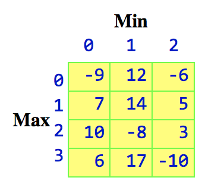
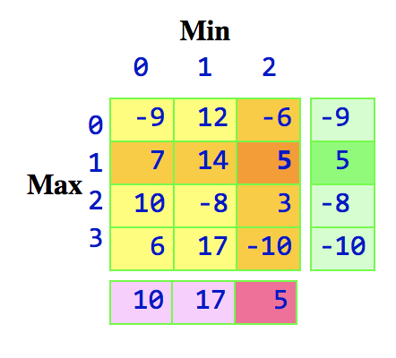

<h1>Coursework Brief - MSc Computer Science</h1>
<h2>Module: CSM080, Objected Oriented Programming</h2>
<h2>Coursework: January to April 2024 study session - End of Term Coursework Assessment</h2>
<h3>Submission Deadline: Monday, 8 April 2024 by 13.00 Greenwich Mean Time</h3>
<ul>
<li>Please note: When the due date is reached, the version you have submitted last, will be considered as your final submission and it will be the version that is marked.</li>
<li>Once the due date has passed, it will not be possible for you to upload a different version of your coursework assessment. Therefore, you must ensure you have submitted the correct version of your coursework assessment which you wish to be marked, by the due date.</li>
</ul>

<strong>Note</strong>: Coursework is weighted at 75% of final mark for the module.

<h3>Coursework Description: Saddle Points</h3>

Consider the following very simple &ldquo;game&rdquo;.  There is a two-dimensional array of numbers, and two players, <em>Maxie</em> and <em>Minnie</em>. At each turn, independently of each other, Max chooses a row and Min chooses a column. Where they intersect is the amount of money Min pays to Max (if it is <em>negative</em>, then
 Max pays Min).

For example, if Max chooses row 1 and Min chooses column 1, then Max wins £14 from Min. If Max chooses row 3 and Min chooses column 2, then Max pays Min £10.
 In general, Max wants larger numbers, and Min wants smaller numbers.

How should they play?

Your class should be named <code>SaddlePoints</code>; this class, and a <code>Main</code> class, should be placed inside a package called <code>saddlePoints</code>.
 <strong>Note</strong> see how these are capitalised and utilise <em>CamelCase</em>.

For each player, we pick the <em>&ldquo;best of the worst&rdquo;</em>. In this example, the worst Max can do if he picks row 0 is -9; if row 1, then 5; if row 2, then -8; and if row 3, then -10. Of these possible worst outcomes, Max prefers the largest, which is 5 (row 1).

Similarly, Min wants smaller numbers. The worst she can do if she picks column 0 is 10; if column 1, then 17; and if column 2, then 5. Of these possible worst outcomes,
 Min prefers the smallest, which is 5 (column 2).

Since the &ldquo;best of the worst&rdquo; (the maximum of the minimums) for Max is 5, and the &ldquo;best of the worst&rdquo; (the minimum of the maximums) for Min is also 5, then Max
 should always choose row 1, and Min should always choose column 2.

This entry of 5, at row 1 and column 2, is called a <em>saddle point</em>. A <em>saddle point</em> is defined to be an entry such that it is minimum in its row and maximum in its column. Indeed, if Min does choose column 2, then Max will do worse by choosing any other row; if Max does choose row 1, then Min will do worse by choosing any other column.

It is possible for there to be more than one saddle point, but in this case, it is known that they will have the same value.

<h2>Specifications</h2>

Here are the computational methods you shall implement. You shall develop a unit test for each of these methods.

<ul>
<li>
<code>int[][] createRandomArray(int numberOfRows, int numberOfColumns, int minValue, int maxValue)</code>
 Creates and returns an array of the given size and fills it with random values in the specified range.

</li>
<li>
<code>int largest(int[] array)</code>
 Finds the largest value in an array of integers.

</li>
<li>
<code>int smallest(int[] array)</code>
 Finds the smallest value in an array of integers.

</li>
<li>
<code>int[] largestValues(int[][] array)</code>
 Takes a two-dimensional array of integers and returns a one-dimensional array containing the largest values in each column (such as the array <code>[10, 17, 5]</code> in the above example).

</li>
<li>
<code>int[] smallestValues(int[][] array)</code>
 Takes a two-dimensional array of integers and returns a one-dimensional array containing the smallest values in each row (such as the array <code>[-9, 5, -8, -10]</code> in the above example).

</li>
<li>
<code>boolean hasSaddlePoint(int[][] array)</code>
 Takes a two-dimensional array of integers and returns <code>true</code> if it has a saddle point and <code>false</code> if it does not.

</li>
<li>
<code>int saddlePointRow(int[][] array)</code>
 Takes a two-dimensional array of integers that is known to have a saddle point, and returns the row number of that saddle point. If there is more than one saddle point, returns the number of any row that contains a saddle point.

</li>
<li>
<code>int saddlePointColumn(int[][] array)</code>
 Takes a two-dimensional array of integers that is known to have a saddle point, and returns the column number of that saddle point. If there is more than one saddle point, returns the number of any column that contains a saddle point.

</li>
</ul>

Here are the I/O methods for which you <strong>do not</strong> need unit tests:

<ul>
<li>
<code>public static void main(String[] args)</code>
 This is responsible for just calling <code>run()</code>.

</li>
<li>
<code>void run()</code> 
 Creates arrays various sizes (including some 2x2 arrays and some larger), fills them with random values, and prints each array and information about it.
 Keeps generating arrays until it has printed at least one with and one without a saddle point. (Smaller arrays are more likely to have a saddle point; about half of randomly generated 2 by 2 arrays will have one.)

</li>
<li>
<code>void printArray(int[][] array)</code> 
 Prints the array.

</li>
<li>
<code>void printArrayInfo(int[][] array)</code> 
 Prints whether the given array has a saddle point, and if so, where it is (row and column) and what its value is. (If there are multiple saddle points, just print any one.)

</li>
</ul>

To save you some typing, we have provided the file <code>SaddlePoints.java</code>, in which all the methods have been entered as stubs, and the comments have been mostly filled out. Start IntelliJ, create the project and the package, and away you go!

<h3>JUnit tests in Java</h3>

We also provide the template for your tests in <code>SaddlePointsTest.java</code>.  Here are some of the more useful JUnit methods:

<ul>
<li><code>assertEquals(expectedValue, actualValue);</code></li>
<li><code>assertArrayEquals(expectedArray, actualArray);</code></li>
<li><code>assertTrue(condition);</code></li>
<li><code>assertFalse(condition);</code></li>
<li><code>fail();</code></li>
</ul>

The method

<pre><code>createRandomArray(numberOfRows, numberOfColumns, minValue, maxValue) 
</code></pre>

should return a different value every time, but you can still test it. Testing whether it's &ldquo;really random&rdquo; is difficult, but the following tests are pretty easy:

<ul>
<li>Test whether the array has the requested number of rows and columns.</li>
<li>Test if all the numbers in the array are in the specified range.</li>
<li>Test that the array isn't full of the same number, repeated over and over.
 (This could happen even if your code is correct; but by choosing a larger array or a
 larger range of values, you can make it extremely unlikely - say, once in a million times.)</li>
</ul>
<h3>Random Numbers</h3>

You will need to import <code>java.util.Random</code>.  You will need to create a random number generator (an instance of the class <code>Random</code>); you will only need one of these.

To get numbers in a reasonable range, you will need to call one of the methods defined in <code>Random</code>. Please read  <a href="https://docs.oracle.com/javase/9/docs/api/java/util/Random.html">this documentation</a> for more information.

<h3>Arrays in Java</h3>

Arrays in Java are like lists in Python, and are indexed the same way. However, the size of an array is specified when you create the array, and you can't add or delete elements. (You can, however, assign a different array to the variable.) You can declare arrays like this:

<ul>
<li><code>type [] name = new type[size];</code></li>
<li><code>type [][] name = new type[rows][columns];</code></li>
</ul>

Declared in this way, all locations in the new array contain <code>null</code>, zero, or false, depending on the type of the array. You can put specific values in an array when you declare it (but not later) like this:

<ul>
<li><code>type [] name = {value1, ..., valueN};</code></li>
<li><code>type [][] name = {{value1_1, ..., value1_N}, ... {valueN_1, ..., valueN_N}};</code></li>
</ul>

To use a literal array in a statement, rather than in a declaration, the syntax is a little different:

<ul>
<li><code>name = type [] {value1, ..., valueN};</code></li>
<li><code>name = type [][] {{value1_1, ..., value1_N}, ... {valueN_1, ..., valueN_N}};</code></li>
</ul>

For testing purposes, you can start by using the following game,

<pre><code>     int[][] with = {{-9, 12, -6},
                     { 7, 14,  5}, 
                     {10, -8,  3}, 
                     { 6, 17,-10}};
</code></pre>

which has a saddle point, and this further game

<pre><code>     int[][] without = {{ 1, -2,  3},
                        {-6,  5, -4}, 
                        { 7, -8,  9}};
</code></pre>

which does not.

<h3>Assessment Criteria:</h3>

Please refer to Appendix C of the Programme Regulations for detailed Assessment Criteria.

<h3>Plagiarism:</h3>

This is cheating. Do not be tempted and certainly do not succumb to temptation. Plagiarised copies are invariably rooted out and severe penalties apply. All assignment submissions are electronically tested for plagiarism. More information may be accessed via: https://learn.london.ac.uk/course/view.php?id=3

